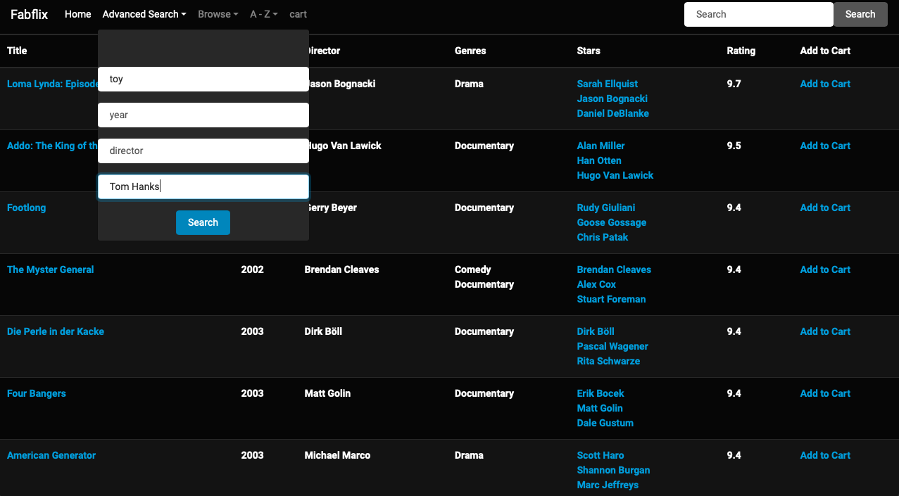
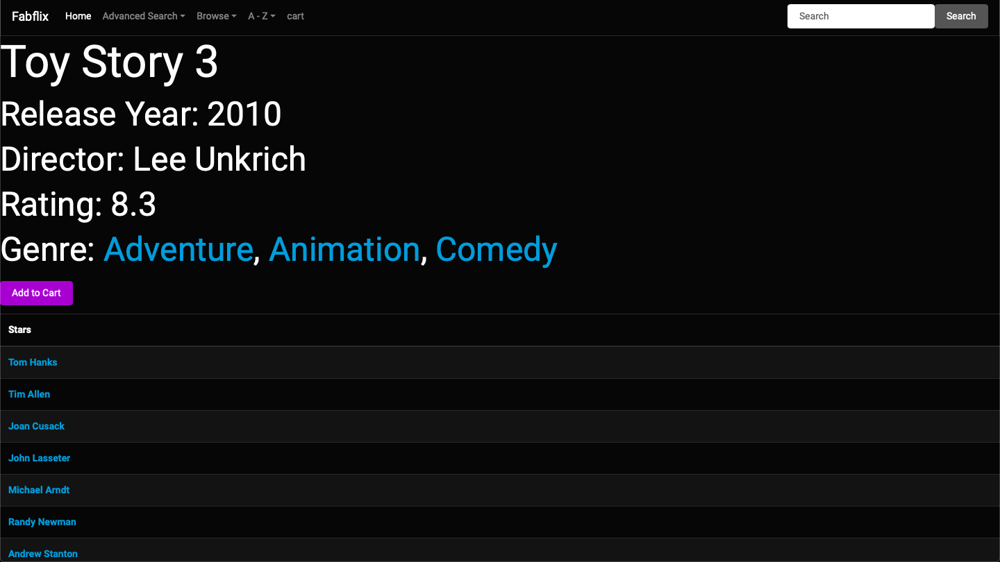

# Fabflix

A full stack Java web application provieded a platform for users searching, browsing and shopping the movies they're interested, which imitated Netflix and IMDb for online movies sale.

## Intruction

Built a full-stack web application including sign-in, sign-up, browse/search and purchase movies based on keywords or different criteria utilizing Java, MySQL, JavaScript, jQuery, BootStrap.

Created Java servlets with RESTful APIs under micro-services architecture for better handling HTTP requests and responses with maximum handling 180 queries per second tested with Apache Jmeter.

Implemented Auto-complete search, fuzzy search and full-text search by injected User-defined function into MySQL.

Improved security using Google ReCaptcha, servlet filter, prepared statement, database encryption, and redirecting to HTTPS. 

Deployed service on both AWS EC2 and GCP with a master-slave load balancer that implemented read/write data separation. 

Developed simple mobile version for both Android and iOS. 

## There is a demo account for your reference.

**Customer account:**
* email: `a@email.com`
* password: `a2`

## Deployed on [AWS EC2](https://3.101.19.225:8443/fabflix/). 

In order to avoid the cumbersome access to https, here is the [http port](http://3.101.19.225:8080/fabflix/) for your reference.

## Demonstration

